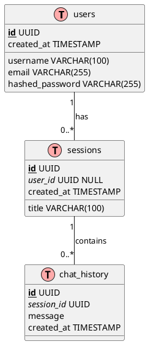
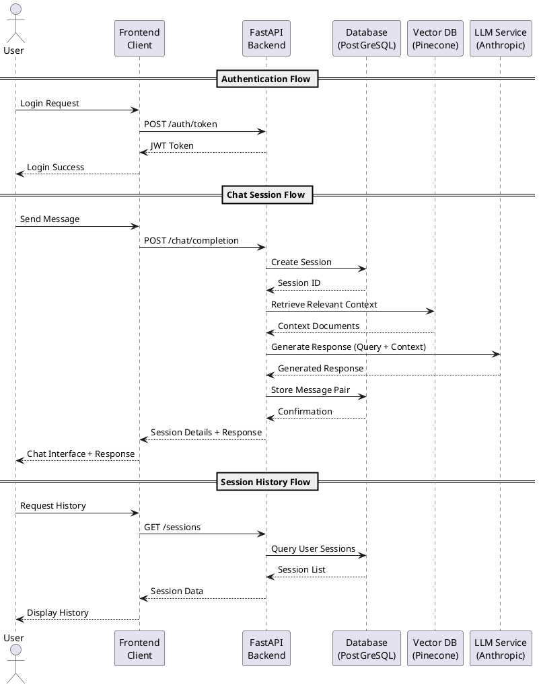

# Implementation Details

This document outlines the implementation details, architectural choices, and technical structure of the Eloquent AI RAG Chatbot application.

## Project Structure

The application follows a clean architecture pattern with clear separation of concerns:

```
project/
|
├── frontend/                      # Next.js + React frontend
│   ├── app/                       # Next.js page components
│   ├── components/                # Reusable UI components
│   ├── hooks/                     # Custom React hooks
│   ├── lib/                       # API client functions
│   ├── providers/                 # React context providers
│   ├── stores/                    # Application state management
│   └── types/                     # TypeScript type definitions
|
├── backend/                       # FastAPI Python backend
│   ├── app/                       # Main application package
│   │   ├── db/                    # Database models and operations
│   │   ├── routers/               # API endpoints and routes
│   │   ├── schemas/               # Pydantic schemas
│   │   ├── services/              # Application services
│   │   └── main.py                # FastAPI application entry point
│   └── requirements.txt           # Python dependencies
|
└── docs/                          # Documentation
    ├── aws-architecture.md        # AWS deployment architecture
    └── implementation-details.md  # Architectural design and implementation details
```

## Architectural Design

### RAG Implementation Architecture

The Retrieval-Augmented Generation (RAG) pattern combines the power of large language models with specific knowledge retrieval to enhance response quality and reduce hallucinations.

1. **Indexing Pipeline**:
   - Knowledge base documents are processed and chunked
   - Chunks are transformed into vector embeddings using a language model
   - Embeddings are stored in Pinecone vector database with metadata

2. **Query Pipeline**:
   - User query is vectorized using the same embedding model
   - Relevant document chunks are retrieved from Pinecone using vector similarity
   - Retrieved context is combined with the user query
   - Combined context + query is sent to the language model for generation
   - Generated response is returned to the user

### Backend Architecture

The backend follows a layered architecture pattern:

- **API Layer**: Handles HTTP requests, validation, and response formatting
- **Service Layer**: Contains core business entities and orchestrates operations
- **Data Access Layer**: Manages interactions with databases and external services

### Frontend Architecture

The frontend follows a component-based architecture with state management:

- **Component Layer**: UI components with presentational logic
- **Custom Hooks**: Encapsulate complex stateful logic and side effects
- **Context Providers**: Manage application-wide state
- **Stores**: Centralized state management
- **Service Layer**: Handle API communication

## Database Schema

The application uses a relational database (AWS Aurora/PostgreSQL) with the following schema:



See `docs/models.svg` file.

<br/>

## API Endpoints

The application exposes the following key API endpoints:



See `docs/flows.svg` file.

<br/>

## Technical Choices

### Language Model Selection

The application uses Anthropic Claude as the large language model (LLM) for response generation. Claude was selected for the following key reasons:

- **Model Size**: offers an excellent balance between quality and performance
- **Context Window**: provides a large context window (up to 100K tokens), sufficient to handle extensive RAG context and chat history
- **Inference Speed**: delivers low latency responses necessary for a real-time chat experience
- **Cost**: pricing model is optimized for production usage, offering good value for the quality of responses
- **Reasoning Capabilities**: excels at understanding context and providing coherent, accurate responses with reduced hallucinations
